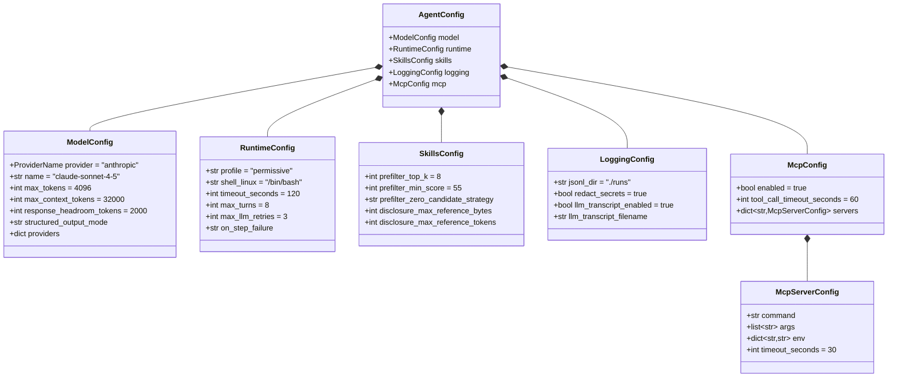

# Architecture Overview

This document describes the system architecture of the Autonomous Skill Agent.

## System Context


## Module Map

```
agent/
├── cli.py                    # Typer CLI entrypoint
├── config.py                 # Pydantic config models + YAML loading
├── types.py                  # Shared type definitions (ActionType, ModelDecision, etc.)
│
├── llm/                      # LLM abstraction layer
│   ├── base_client.py        # BaseLlmClient ABC + LlmResult
│   ├── anthropic_client.py   # Anthropic provider (Messages API + tool_use)
│   ├── gemini_client.py      # Gemini provider (GenerateContent + function calling)
│   ├── provider_router.py    # ProviderRouter — dispatches to active provider
│   ├── prompt_builder.py     # Builds prompt with task, skills, context, MCP tools
│   ├── structured_output.py  # JSON extraction + agent_decision tool schema
│   ├── decoder.py            # Normalizes raw LLM output → ModelDecision
│   └── token_budget.py       # Token budget allocation
│
├── skills/                   # Skill loading and routing
│   ├── parser.py             # Parses SKILL.md → SkillDefinition
│   ├── registry.py           # SkillRegistry — loads all skills from directory
│   ├── router.py             # SkillRouter — rapidfuzz prefiltering
│   └── disclosure.py         # DisclosureEngine — progressive context stages
│
├── runtime/                  # Orchestration and execution
│   ├── orchestrator.py       # Orchestrator — main run loop (the brain)
│   ├── executor.py           # CommandExecutor — shell subprocess runner
│   ├── retry.py              # Backoff + retryable error classification
│   ├── signals.py            # SIGINT/SIGTERM graceful shutdown
│   ├── policies.py           # Runtime policy definitions
│   ├── state_machine.py      # State machine helpers
│   ├── shell_linux.py        # Linux shell command builder
│   └── shell_windows.py      # Windows shell command builder
│
├── mcp/                      # Model Context Protocol integration
│   └── client.py             # McpManager — sync wrapper over async MCP SDK
│
├── logging/                  # Observability infrastructure
│   ├── events.py             # EventBus — structured JSONL event emission
│   ├── jsonl_sink.py         # JsonlSink — file-backed event writer
│   ├── transcript.py         # LlmTranscriptSink — human-readable LLM logs
│   ├── redaction.py          # Secret redaction + text summarization
│   └── sanitizer.py          # Control character sanitization
│
├── security/                 # Security controls
│   ├── provenance.py         # Path traversal validation for disclosure
│   └── secret_filter.py      # Secret pattern detection
│
└── storage/                  # Run artifact storage
    └── run_store.py          # Run directory creation + artifact writing
```

## Layer Diagram


## Configuration Model



Config is loaded from `agent.yaml` with discovery precedence:
1. `--config <path>` CLI flag
2. `./agent.yaml` (working directory)
3. `~/.config/agent/agent.yaml` (user home)
4. Built-in defaults (all fields have defaults)

## Provider Abstraction


### Structured Output Modes

| Mode | Behavior |
|------|----------|
| `json_only` | LLM returns raw JSON text, parsed by `extract_json_payload()` |
| `native_with_json_fallback` | Uses provider tool_use/function_calling; falls back to JSON on failure |
| `native_only` | Requires tool_use/function_calling; fails if not returned |

Both providers use the same `agent_decision` tool schema (defined in `structured_output.py`).
The orchestrator never sees provider-specific formats — `ProviderRouter` normalizes everything to `LlmResult`.

## Skill System


### Progressive Disclosure Stages

| Stage | What is disclosed | When |
|-------|-------------------|------|
| **0** | Metadata catalog only (name, description, tags, allowed_tools) | Always — `ALL_SKILL_FRONTMATTER` in every prompt |
| **1** | First 2 body sections from SKILL.md | Before first LLM call, for the top candidate |
| **2** | Requested reference files (path-validated) | When LLM requests `required_disclosure_paths` |
| **3** | Script descriptors | On demand |

Stage 2 enforces **provenance validation** — paths must resolve within the skill directory (no path traversal).

## Action System


### Canonical Action Types

| Action | `params` schema | Executed by |
|--------|----------------|-------------|
| `run_command` | `{"command": "shell command"}` | `CommandExecutor.run()` |
| `call_skill` | `{"skill_name": "target-skill"}` | Orchestrator (disclosure + re-prompt) |
| `mcp_call` | `{"tool_name": "name", "arguments": {...}}` | `McpManager.call_tool()` |
| `ask_user` | `{"message": "question"}` | Skipped in non-interactive mode |
| `finish` | `{"message": "summary"}` | Triggers final answer synthesis |

### Decoder Normalization

The decoder (`decoder.py`) normalizes raw LLM output to canonical action types:


Base aliases include:
- `execute_skill` / `invoke_skill` / `use_skill` → `call_skill`
- `run` / `run_shell` / `execute_command` → `run_command`
- `mcp_tool` / `mcp_invoke` / `call_mcp` / `use_mcp_tool` / `mcp` → `mcp_call`
- `complete` / `format_output` / `summarize_output` → `finish`
