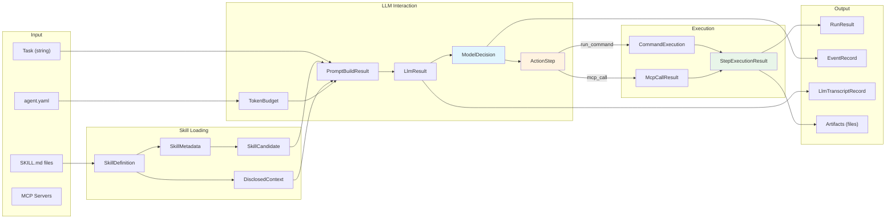
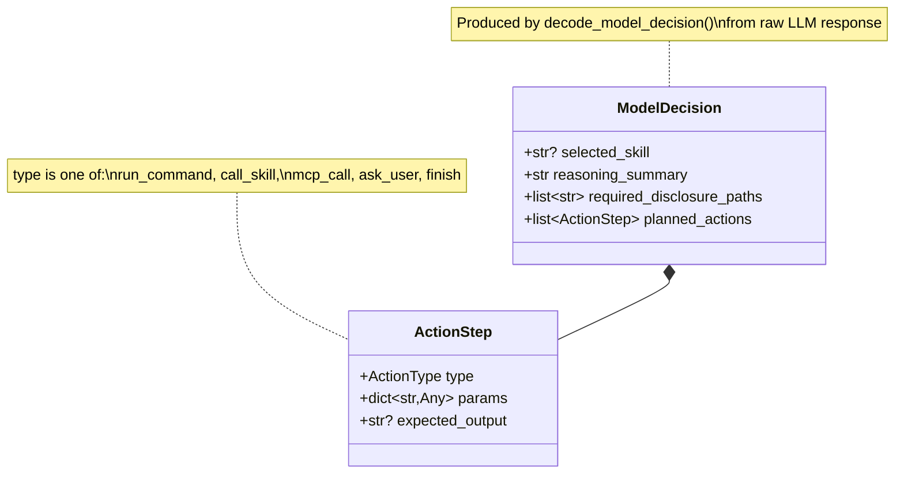
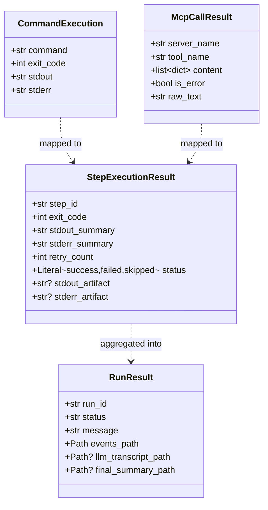
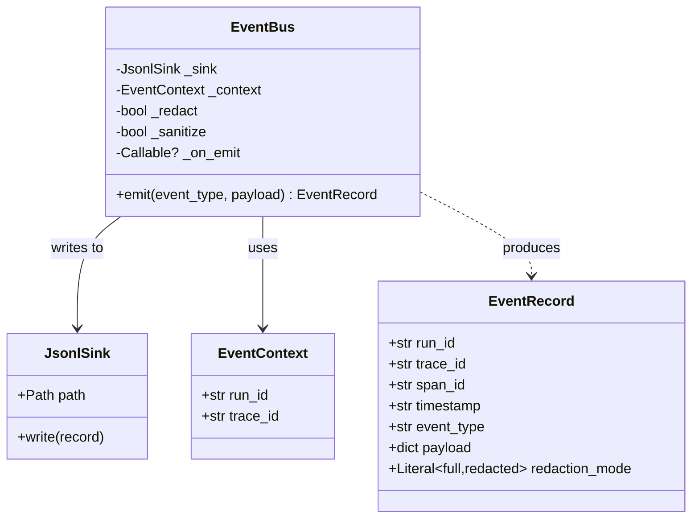
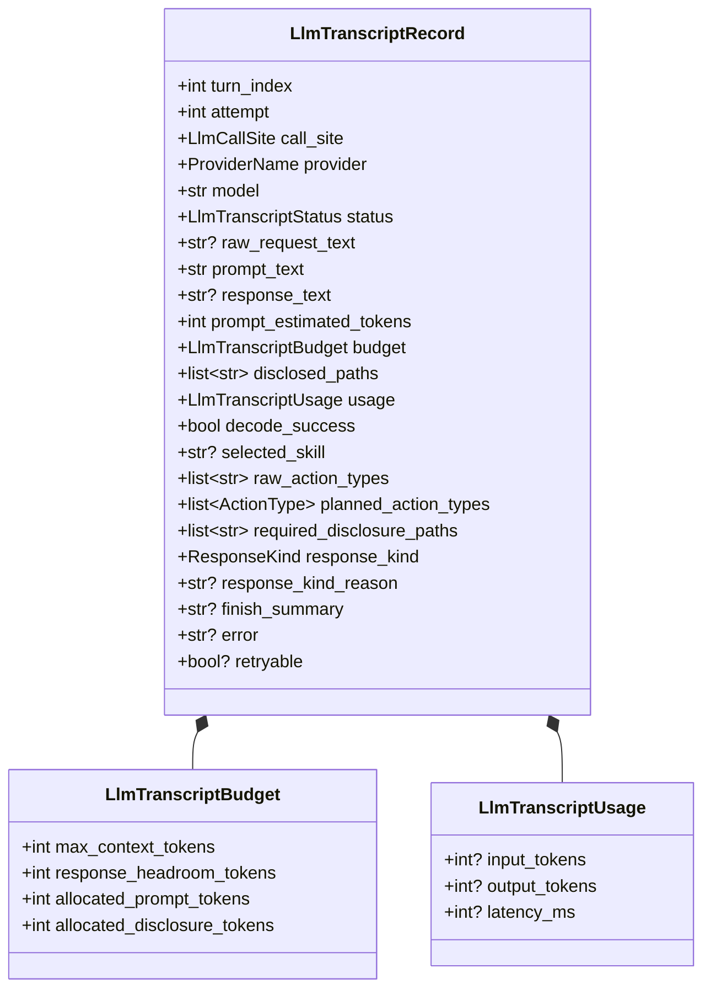
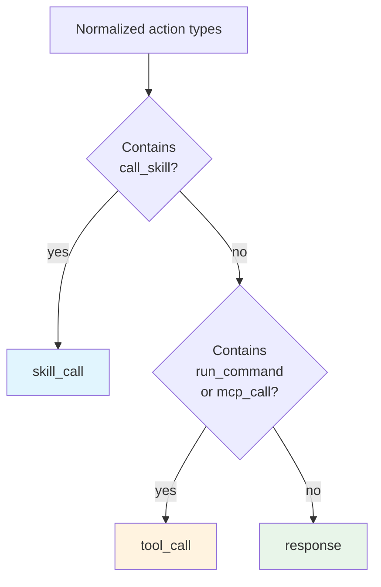

# Data Models and Type System

All shared types are defined in `agent/types.py` as Pydantic models.

## Core Type Literals

```python
ActionType = Literal["call_skill", "run_command", "ask_user", "finish", "mcp_call"]
ResponseKind = Literal["skill_call", "tool_call", "response"]
LlmTranscriptStatus = Literal["success", "request_failed", "decode_failed"]
LlmCallSite = Literal["decision_loop", "final_answer_synthesis", "unspecified"]
ProviderName = Literal["anthropic", "gemini"]
```

## Data Flow Diagram



## Model Decision (LLM Output)



### ActionStep Params by Type

| ActionType | Required params | Optional params |
|------------|----------------|-----------------|
| `run_command` | `command: str` | — |
| `call_skill` | `skill_name: str` | `instructions: str` |
| `mcp_call` | `tool_name: str`, `arguments: dict` | — |
| `ask_user` | `message: str` | — |
| `finish` | — | `message: str`, `summary: str`, `result: str` |

## Execution Results



## Event System



### Event Types Reference

| Event | Phase | Payload |
|-------|-------|---------|
| `run_started` | Start | task, provider, dry_run, max_turns |
| `skill_catalog_loaded` | Load | skills_count, skills_dir |
| `skill_prefilter_completed` | Route | candidates, candidate_count |
| `skill_disclosure_loaded` | Disclose | stage, paths, total_bytes, total_tokens |
| `mcp_servers_connected` | MCP | server_count, tool_count, tools |
| `mcp_connection_failed` | MCP | error |
| `prompt_budget_computed` | Prompt | token budget breakdown |
| `prompt_composed` | Prompt | prompt_hash, estimated_input_tokens |
| `llm_request_sent` | LLM | provider, model, attempt, turn_index, call_site |
| `llm_response_received` | LLM | turn_index, call_site, meta, response_preview |
| `llm_request_failed` | LLM | error, retryable, call_site |
| `llm_retry_scheduled` | LLM | delay_seconds, attempt |
| `native_tool_fallback` | LLM | turn_index, reason |
| `llm_decision_decoded` | Decode | turn_index, selected_skill, planned_actions |
| `self_handoff_detected` | Loop | selected_skill, count |
| `self_handoff_constraint_applied` | Loop | blocked_skill |
| `self_handoff_recovery_applied` | Loop | recovery_action_types |
| `skill_invocation_started` | Execute | turn_index, selected_skill |
| `skill_step_executed` | Execute | step_id, type, status, command |
| `step_retry_scheduled` | Execute | step_id, retry_count |
| `mcp_tool_call_started` | MCP | step_id, tool_name |
| `mcp_tool_call_completed` | MCP | step_id, tool_name, server, status |
| `mcp_tool_call_failed` | MCP | step_id, tool_name, error |
| `skill_invocation_finished` | Execute | step_results |
| `final_answer_synthesis_started` | Synth | evidence_items |
| `final_answer_synthesis_completed` | Synth | summary_preview |
| `final_answer_synthesis_failed` | Synth | reason |
| `mcp_servers_disconnected` | Cleanup | — |
| `run_finished` | End | turn_index, final_summary |
| `run_failed` | End | reason |

## LLM Transcript Record



## Response Kind Classification



## Run Directory Structure

```
runs/<run_id>/
├── events.jsonl                  # All EventRecord entries
├── llm_transcript.log            # Human-readable LLM attempt logs
├── dry_run_prompt.txt            # (dry-run only) Full prompt text
├── final_summary.md              # Synthesized final answer
└── artifacts/
    ├── llm/
    │   ├── decision_loop_turn_1_attempt_1_request.txt
    │   ├── decision_loop_turn_1_attempt_1_response.txt
    │   ├── final_answer_synthesis_turn_3_attempt_1_request.txt
    │   └── final_answer_synthesis_turn_3_attempt_1_response.txt
    ├── turn_1_step-1_stdout.txt
    ├── turn_1_step-1_stderr.txt
    ├── turn_2_step-1_mcp_stdout.txt
    └── final_answer_prompt_turn_3.txt
```
