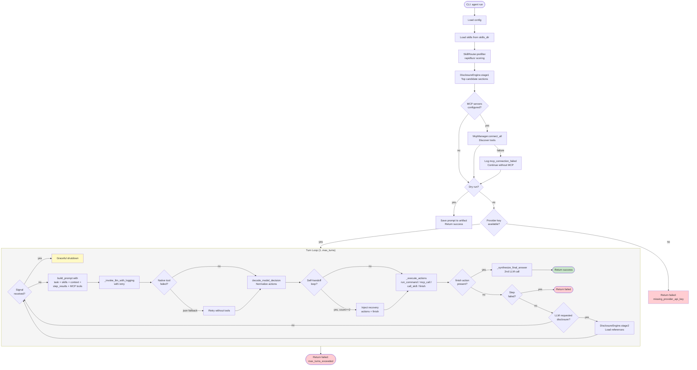
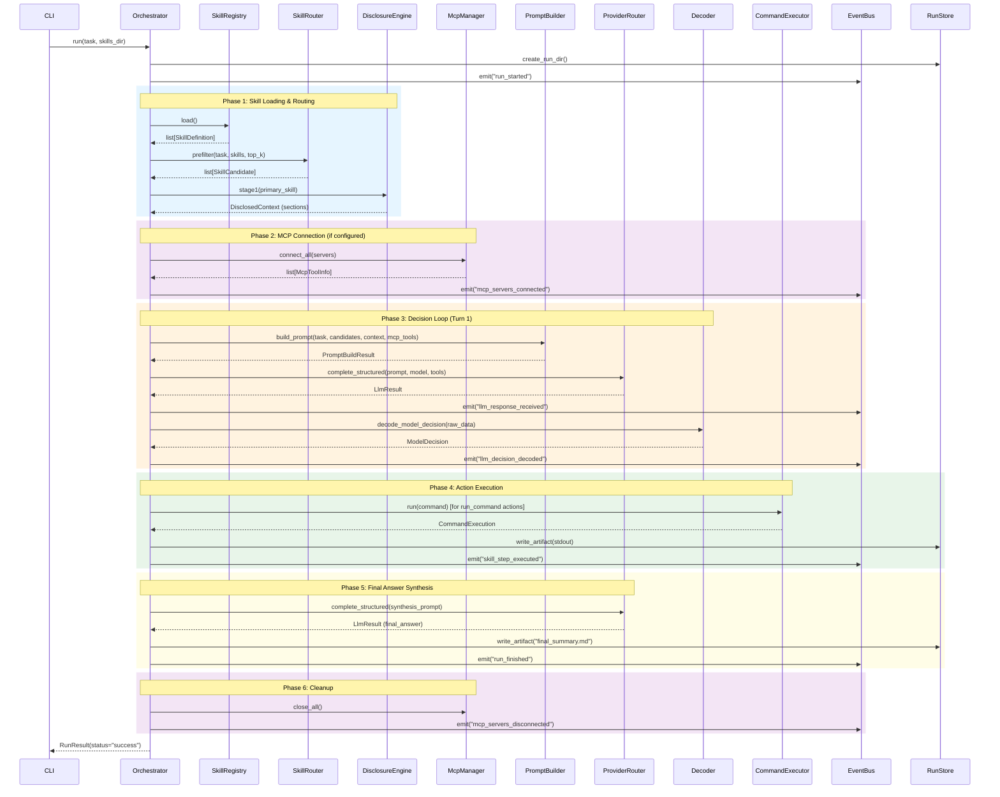
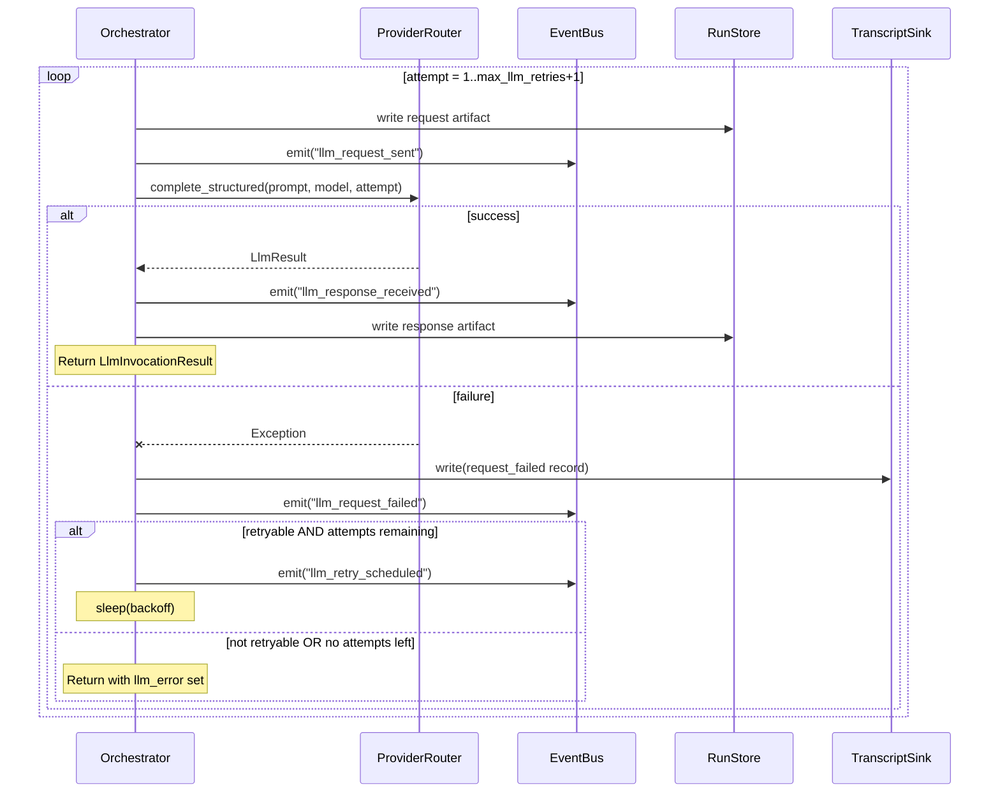
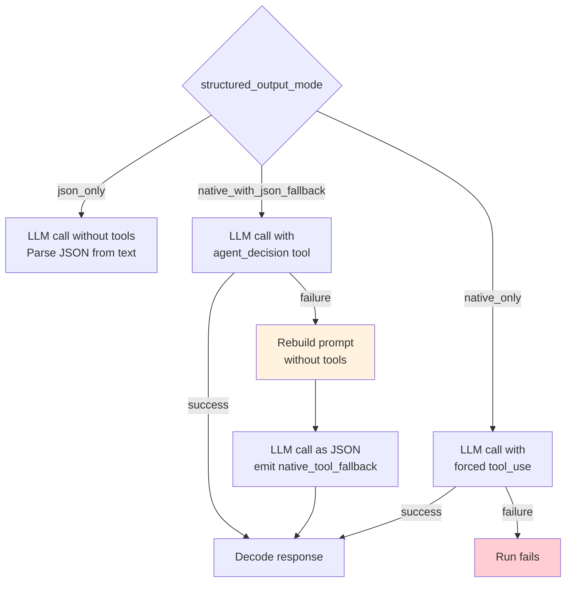
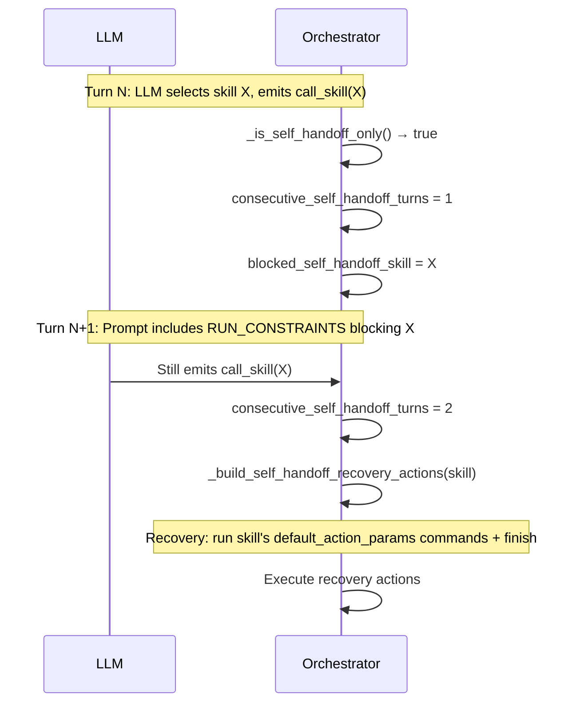
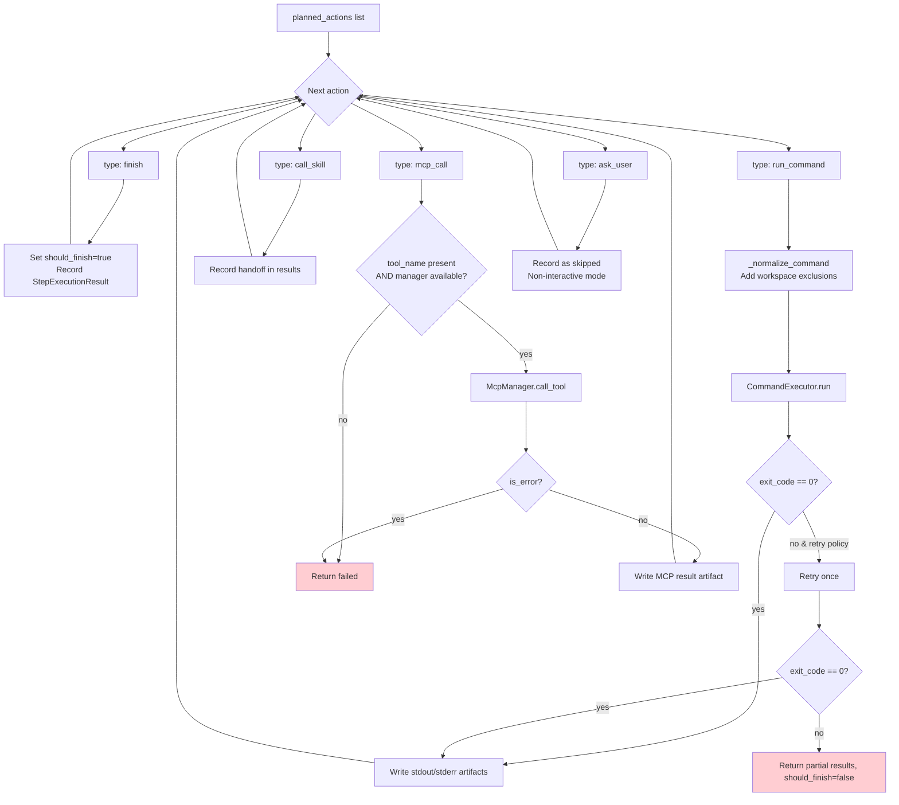
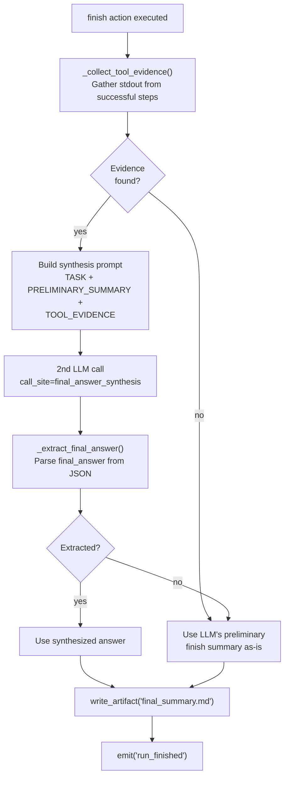

# Decision Loop — Orchestrator Runtime

This document describes the orchestrator's main run loop with sequence diagrams showing exact control flow as implemented in `agent/runtime/orchestrator.py`.

## High-Level Run Flow



## Detailed Sequence: Successful Run



## LLM Invocation with Retry

Every LLM call goes through `_invoke_llm_with_logging()`:



Retryable status codes: `429, 500, 502, 503, 529`.
Non-retryable (fail fast): `400, 401, 403, 404`.

## Native Tool Use Fallback



## Self-Handoff Detection & Recovery

When the LLM repeatedly emits `call_skill` to the same skill without producing new executable work:



Recovery uses the skill's own `default_action_params` (from SKILL.md frontmatter) to extract up to 2 runnable commands. If the skill has no defaults, recovery is just a `finish` action.

## Action Execution Flow



## Final Answer Synthesis

After the LLM emits a `finish` action, the orchestrator optionally makes a second LLM call to synthesize a better answer from tool evidence:



## Prompt Structure

Each decision loop prompt contains these sections in order:

```
┌─────────────────────────────────────────────┐
│ INSTRUCTION                                  │
│ (Rules for action types, tool usage, etc.)   │
├─────────────────────────────────────────────┤
│ TASK                                         │
│ (User's original task text)                  │
├─────────────────────────────────────────────┤
│ RUN_STATE                                    │
│ (executed_steps with stdout/stderr summaries)│
├─────────────────────────────────────────────┤
│ RUN_CONSTRAINTS (if any)                     │
│ (blocked_call_skill_targets for self-handoff)│
├─────────────────────────────────────────────┤
│ ALL_SKILL_FRONTMATTER                        │
│ (Lightweight catalog: name, desc, tags, etc.)│
├─────────────────────────────────────────────┤
│ CANDIDATE_SKILLS                             │
│ (Prefilter results with scores)              │
├─────────────────────────────────────────────┤
│ DISCLOSED_CONTEXT                            │
│ (Stage 1/2 skill content loaded so far)      │
├─────────────────────────────────────────────┤
│ MCP_TOOLS (if MCP servers connected)         │
│ (Tool name, description, server, schema)     │
└─────────────────────────────────────────────┘
```

The LLM returns a `ModelDecision`:
```json
{
  "selected_skill": "skill-name or null",
  "reasoning_summary": "why",
  "required_disclosure_paths": ["references/file.md"],
  "planned_actions": [
    {"type": "run_command", "params": {"command": "ls -la"}},
    {"type": "finish", "params": {"message": "Done"}}
  ]
}
```
