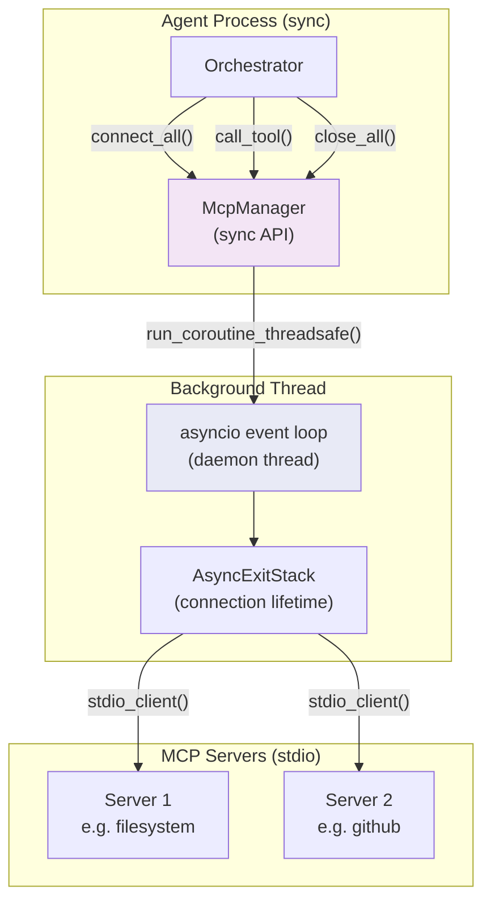
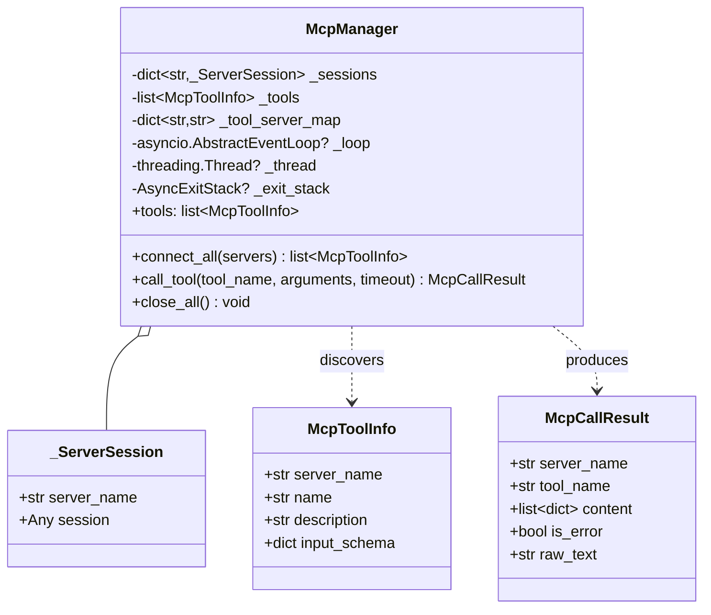
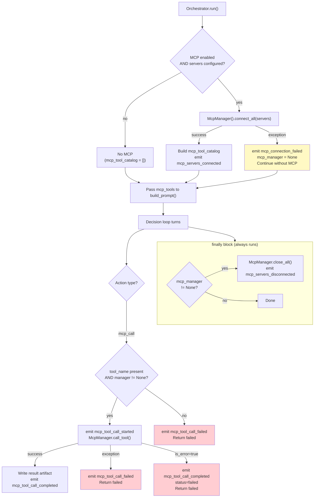
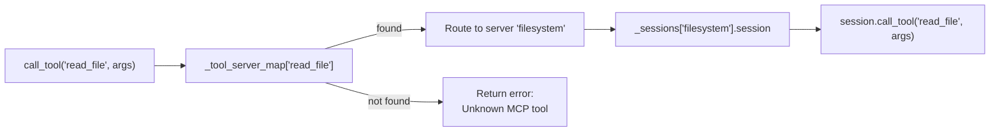

# MCP (Model Context Protocol) Integration

MCP enables the agent to connect to external tool servers and invoke their tools during task execution.

## Architecture



## Async Bridging Pattern

The MCP Python SDK is async; the orchestrator is sync. `McpManager` bridges this gap:

```mermaid
sequenceDiagram
    participant ORCH as Orchestrator (sync)
    participant MGR as McpManager
    participant LOOP as Background asyncio loop
    participant SDK as MCP SDK (async)

    Note over MGR,LOOP: _start_loop(): creates event loop in daemon thread

    ORCH->>MGR: connect_all(servers)
    MGR->>LOOP: run_coroutine_threadsafe(_async_connect_all)
    LOOP->>SDK: stdio_client(params)
    SDK-->>LOOP: (read_stream, write_stream)
    LOOP->>SDK: ClientSession(streams)
    SDK-->>LOOP: session
    LOOP->>SDK: session.initialize()
    LOOP->>SDK: session.list_tools()
    SDK-->>LOOP: tools list
    LOOP-->>MGR: list[McpToolInfo]
    MGR-->>ORCH: list[McpToolInfo]

    ORCH->>MGR: call_tool("read_file", {path: "/tmp/x"})
    MGR->>MGR: _tool_server_map["read_file"] → "filesystem"
    MGR->>LOOP: run_coroutine_threadsafe(_async_call_tool)
    LOOP->>SDK: session.call_tool("read_file", arguments)
    SDK-->>LOOP: result
    LOOP-->>MGR: McpCallResult
    MGR-->>ORCH: McpCallResult

    ORCH->>MGR: close_all()
    MGR->>LOOP: run_coroutine_threadsafe(_async_close_all)
    LOOP->>SDK: exit_stack.aclose()
    MGR->>MGR: _stop_loop()
```

## McpManager Class



## Configuration

```yaml
# agent.yaml
mcp:
  enabled: true
  tool_call_timeout_seconds: 60
  servers:
    filesystem:
      command: "npx"
      args: ["-y", "@modelcontextprotocol/server-filesystem", "/home/user/projects"]
      timeout_seconds: 15
    github:
      command: "uvx"
      args: ["mcp-server-github"]
      env:
        GITHUB_TOKEN: "${GITHUB_TOKEN}"
```

## MCP in the Prompt

When MCP servers are connected, discovered tools appear in the `MCP_TOOLS` prompt section:

```json
MCP_TOOLS:
[
  {
    "name": "read_file",
    "description": "Read a file from the filesystem",
    "server": "filesystem",
    "input_schema": {
      "type": "object",
      "properties": {
        "path": {"type": "string"}
      },
      "required": ["path"]
    }
  }
]
```

The LLM uses `mcp_call` actions to invoke these tools:

```json
{
  "type": "mcp_call",
  "params": {
    "tool_name": "read_file",
    "arguments": {"path": "/tmp/test.txt"}
  }
}
```

## MCP Lifecycle in the Orchestrator



## Error Handling

| Scenario | Behavior |
|----------|----------|
| `mcp` package not installed | `connect_all()` raises ImportError; caught, run continues without MCP |
| Server connection failure | `mcp_connection_failed` event; `mcp_manager = None`; no MCP tools in prompt |
| Tool call returns `is_error=true` | `StepExecutionResult` with `status="failed"`; follows `on_step_failure` policy |
| Tool call raises exception | Caught; `mcp_tool_call_failed` event; step fails |
| Unknown tool name | `McpManager.call_tool()` returns error result (no matching server) |
| Server crash mid-run | `call_tool()` raises; caught by executor try/except |
| Cleanup failure | Suppressed via `try/except` in `finally` block |

## Tool Name Routing

`McpManager` maintains an internal `_tool_server_map: dict[str, str]` that maps tool names to server names. When `connect_all()` discovers tools from each server, it populates this map. If two servers expose a tool with the same name, the last-connected server wins (documented limitation).



## Installation

MCP is an optional dependency:

```bash
# Install with MCP support
pip install 'autonomous-skill-agent[mcp]'

# Or via uv
uv sync --extra mcp
```

The `mcp` SDK import is lazy (inside `_async_connect_all()`), so the agent works without it installed when MCP is not configured.
